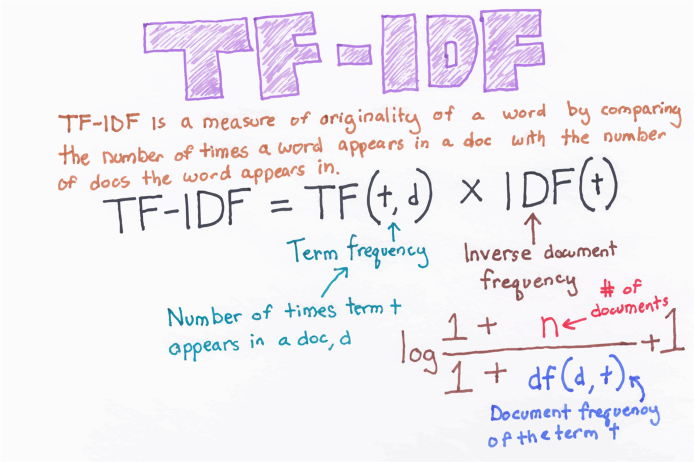

# Regression Project

## Data Gathering and Cleaning

The data was collected from the YouTube's playlist, the one that we used during out lectures.

Then the raw data is written in the file named `data.csv`.

Afterwards, we are going to clean the raw data.

For that purpose, we use `nltk` library to remove punctuations, stopwords, numbers, etc.
Cleaned data is saved in a file named `cleaned_data.csv`.

Now we need to calculate `tf-idf` for each word in the documents.

### **How is `TF-IDF` calculated ?**



`TF-IDF` for a word in a document is calculated by multiplying two different metrics:

- The **term frequency** of a word in a document. There are several ways of calculating this frequency, with the
  simplest
  being a raw count of instances a word appears in a document. Then, there are ways to adjust the frequency, by length
  of a document, or by the raw frequency of the most frequent word in a document.
- The **inverse document frequency** of the word across a set of documents. This means, how common or rare a word is in
  the
  entire document set. The closer it is to 0, the more common a word is. This metric can be calculated by taking the
  total number of documents, dividing it by the number of documents that contain a word, and calculating the logarithm.
- So, if the word is very common and appears in many documents, this number will approach 0. Otherwise, it will approach
  to 1.

Next, we are going to perform sentiment analysis.
I have used `afinn` library to assign sentiment values to each document from `cleaned_data.csv`.
The result from the analysis is saved into `data_with_sentiment_analysis.csv`.

## Data Analysis and Regression

We're going to analyse the relation between video `likes` and `views`.


As we can see from the scatter plot there's strong linear relation between these two variables.

So, we can do linear regression to find the best linear function that describes the relation.


Then we are viewing the desired metrics:

```md
Score: 0.9228154633523422
Coefficients:  [[0.00955015]]
Intercept:  [687.49364687]
t-statistics:  92.35199654274811
R2 score:  0.7951924316063258
```

### Coefficient

Each independent variable in a linear regression model has its own coefficient. The coefficient for an independent
variable represents the change in the dependent variable associated with a one-unit change in the independent variable,
while holding all other independent variables constant. In other words, it represents how much the dependent variable
changes for each unit change in the independent variable.

The coefficients can be positive, negative, or zero, depending on the relationship between the independent and dependent
variables. If the coefficient is positive, it means that as the independent variable increases, the dependent variable
also increases. If the coefficient is negative, it means that as the independent variable increases, the dependent
variable decreases. If the coefficient is zero, it means that the independent variable has no effect on the dependent
variable.

The magnitude of the coefficients can also provide information about the strength of the relationship between the
independent and dependent variables. In general, larger coefficients indicate a stronger relationship.

### t-statistics

The t-statistics of independent variables in a regression analysis are used to assess the statistical significance of
each independent variable in explaining the variation in the dependent variable. The t-statistic is the ratio of the
estimated coefficient of the independent variable to its standard error.

A positive t-statistic indicates that the estimated coefficient of the independent variable is positively associated
with the dependent variable, while a negative t-statistic indicates that the estimated coefficient is negatively
associated with the dependent variable. The magnitude of the t-statistic reflects the strength of the association. The
larger the t-statistic, the stronger the association.

The null hypothesis for the t-test is that the true coefficient of the independent variable is equal to zero, which
means that the independent variable has no effect on the dependent variable. If the absolute value of the t-statistic is
greater than the critical value from a t-distribution with degrees of freedom equal to the number of observations minus
the number of independent variables, then the null hypothesis can be rejected and the independent variable is considered
to have a statistically significant effect on the dependent variable.

## Logistic Regression

We are going to analyse the relation between the `views` and `sentiments`.


## Decision Tree
```md
Accuracy: 0.53

|--- views <= 1839095.50
| |--- views <= 221717.50
| | |--- views <= 208714.00
| | | |--- views <= 47743.50
| | | | |--- views <= 39947.50
| | | | | |--- views <= 23411.00
| | | | | | |--- class: 0
| | | | | |--- views >  23411.00
| | | | | | |--- views <= 28733.50
| | | | | | | |--- views <= 26410.00
| | | | | | | | |--- class: 2
| | | | | | | |--- views >  26410.00
| | | | | | | | |--- views <= 26797.00
| | | | | | | | | |--- class: 0

```